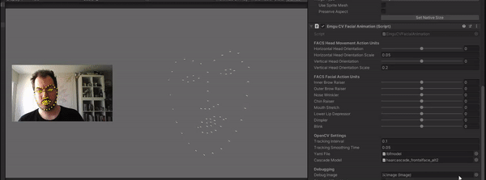
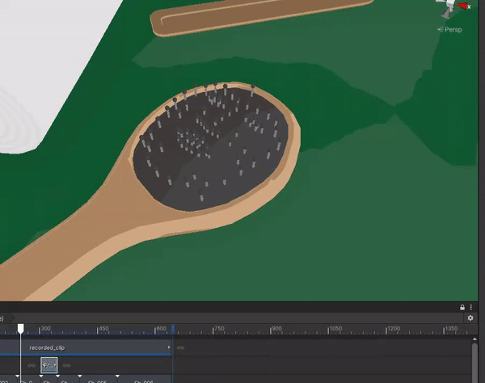

# EmguCV Facial Landmarks for Unity
## An OpenCV-Based Facial Animation Tool

This small Unity 2019.3.6 project is a work-in-progress facial animation tool built on the EmguCV facial landmark detection framework. It's far from complete but for now you can use it with any old webcam to automatically detect facial landmarks and smoothly animate objects based on their positions. Here's a hairbrush freaking out animated by the tool!

In the future this repo will be expanded as a more stable complete tool with a FACS/Blendshapes system.

